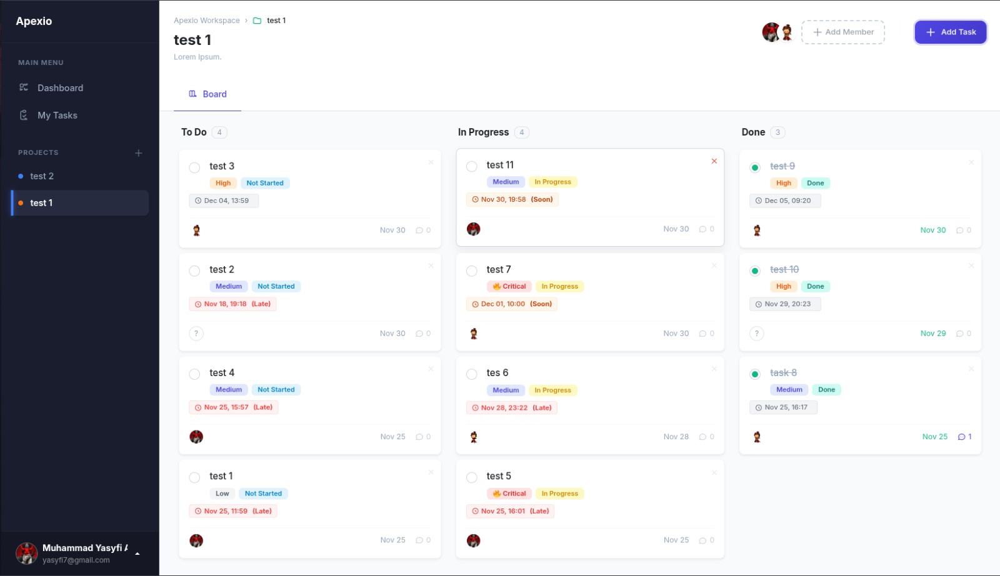

# Apexio - Project Management System

**Apexio** is a web-based project management application designed to facilitate efficient team collaboration. This application is built using **Laravel 11** and **Livewire 3**, adopting a *Modern Monolith* approach.

---

## 📸 Application Interface

Below is the main interface of Apexio, featuring the Sidebar and Kanban Board:



---

## ✨ Key Features

### 1. Advanced Task Management (Kanban)
* **Drag & Drop Kanban:** Interactive board allowing users to move tasks between statuses (To-Do, In-Progress, Done) seamlessly using SortableJS.
* **Real-time Due Dates:** Smart deadline system with auto-updating badges ("Soon" or "Late") based on local user time.
* **Task Details:** Comprehensive card view with priority levels, assignees, and threaded discussions (comments).

### 2. Personal Workspace
* **"My Tasks" Page:** A dedicated aggregation view displaying all tasks assigned to the current user across multiple projects, sorted by urgency.
* **Navigation Sidebar:** A fixed, responsive sidebar with active state indicators and quick access to recent projects.

### 3. Administration & Security
* **Super Admin Dashboard:** Exclusive panel for system oversight, featuring real-time statistics (Total Users, Projects, Active Tasks).
* **User Management:** Admin tools to monitor user lists, view **Real-time Online Status**, reset passwords, and manage access roles.
* **Role-Based Access Control (RBAC):** Strict authorization logic ensuring users can only modify their own tasks, while Admins have full oversight.

### 4. User Profile & Settings
* **Profile Management:** Users can update their details and upload profile photos with instant preview.
* **Smart Avatars:** System automatically generates initial-based avatars for users without profile photos.
* **Account Security:** Centralized settings for password updates and secure account deletion.

### 5. Modern UI/UX
* **Responsive Layout:** Built with Flexbox and Bootstrap 5 + SCSS for a pixel-perfect experience on any screen size.
* **Interactive Feedback:** Toast notifications and visual cues (cursor changes, loading states) for a smooth user experience.

---

## 🛠️ Technology Stack

* **Backend:** Laravel 11
* **Frontend:** Livewire 3
* **Styling:** Bootstrap 5 + SCSS (Custom)
* **Database:** MySQL / MariaDB
* **Scripting:** Alpine.js + SortableJS

---

## 💻 Installation Guide

Ensure you have **PHP 8.2+**, **Composer**, and **Node.js** installed before starting.

### 1. Initial Setup
Run the following commands in your terminal (Command Prompt / Bash):
```bash
# Clone the repository
git clone https://github.com/noireveil/Apexio.git
cd Apexio

# Install Backend & Frontend dependencies
composer install
npm install

# Duplicate environment configuration
cp .env.example .env

# Generate Application Key
php artisan key:generate
```

### 2. Database Configuration
Open the `.env` file and adjust the database configuration (`DB_DATABASE=apexio`). Then follow the steps for your operating system:

#### A. Windows Users (Laragon/XAMPP)
1. Ensure Laragon/XAMPP is running (Start All).
2. Open HeidiSQL (Laragon) or phpMyAdmin.
3. Create a new database named: `apexio`.
4. Ensure the `.env` file matches your credentials (Laragon default is usually user: `root`, password: empty).

#### B. Linux Users (Terminal)
1. Ensure the database service is running: `sudo systemctl start mariadb` (or `mysql`).
2. Login to MySQL and create the database:
```bash
mysql -u root -p -e "CREATE DATABASE apexio;"
```
3. Adjust the database username and password in the `.env` file if you use custom credentials.

### 3. Migration & Storage
Once the database is ready, run the following commands in the project terminal to create tables and seed initial data:
```bash
# Create tables and seed initial data (Seeder)
php artisan migrate:fresh --seed

# Create a shortcut so profile photos are publicly accessible (MANDATORY)
php artisan storage:link
```

### 4. Running the Application (IMPORTANT)
This application requires two terminal processes running simultaneously for the Backend functions and Frontend styling to work.

**Terminal 1 (Run Laravel Server):**
```bash
php artisan serve
```

**Terminal 2 (Run Asset Compilation / Vite):**
```bash
npm run dev
```

Access the application via browser at: **http://localhost:8000**

---

## 🔐 Default Credentials (Demo Access)

To facilitate testing/grading, the application comes with pre-configured accounts generated by the seeder:

| Role | Email | Password | Access Level |
|------|-------|----------|--------------|
| Super Admin | admin@apexio.com | password | Full System Access (Admin Dashboard) |
| Regular User | user@apexio.com | password | Project Management Only |

**Note:** Run `php artisan migrate:fresh --seed` to generate these accounts.